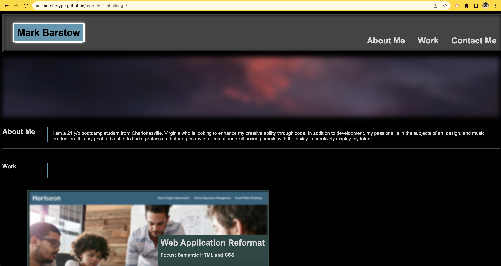

## README

# Mark Barstow / Personal Portfolio

## Goals

### Styling with CSS to create a responsive layout without starter code

- The purpose of this project was to create a website for myself to display my own work online in a portfolio.

- Flex is a display property that allows page elements to dynamically shift with a changing window dimension.

        display: flex;
        justify-content: flex-end;
        align-content: center;

    In many cases, this is a much more efficient way to style a page and organize the items on a web application.

- Media queries are also useful in providing responsiveness to a webpage. When the screen gets compressed to a certain size, it will allow the developer to implement changes to the styles of certain elements:

        @media screen and (768px) {
            .background-image {
                size: 50%;
            }

            h2 {
                text-decoration: none;
            }
        }

    This is a simple example of using the screen's width to dictate the size and styling of elements in a page. 

## Challenges and Application

- The biggest challenge I faced while developing this site from the ground up was the organization of my HTML and CSS properties. I feel as though some of my initial placements for certain stylings in my syntax hindered my ability to change the layout of my page easily at the start. Although I managed to make most of the changes that I wanted to on the page, I still had issues with the styling of my project cards; more specifically the smaller ones and was not able to get their title cards to show in time for the deadline. This will be something I look to debug very soon.

- I have really enjoyed learning how to style elements on the page, including things like transitions and 

        :hover 

    syntax. While these aspects of coding are very fun, I have had great difficulty in streamlining my approach to graphical layout efficiency.

## Webpage Deployment

- The link to the deployed GitHub Pages Website is [here](https://marchetype.github.io/module-2-challenge/).

- Screenshot of deployed site: 

